<!-- reading the source. good instinct. -->

<p align="center">
  
</p>

<p align="center"><code>friendly, probably.</code> &nbsp;·&nbsp; <a href="https://more-than-just-kyrion.github.io/more-than-just-kyrion/">about page ↗</a></p>

### `$ cat about.md`

showed up out of nowhere and fixed a stranger's broken installer in about an hour. the original dev came back to merge it. that's usually where the questions start.

security has been non-negotiable for me since late primary school. the details stay private. that's the point.

linux, old games, and anything that looks locked. more when it's ready.

### `$ whois kyrion`

```text
first seen    2025-02, out of nowhere
first move    fixed a stranger's installer in ~1h. merged upstream.
security      non-negotiable since late primary school
builds        things that stay contained
status        friendly, probably.
```

### `$ tail now.log`

- nanoborealis: an agent that can't leave its box
- keeping old versions playable
- [redacted]

### `$ ls ~/projects`

| | |
|---|---|
| [`nanoborealis`](https://github.com/more-than-just-kyrion/nanoborealis) | a linux desktop with an agent living inside it. writes, runs and fixes code, borrows your gpus, and can't reach your files or your network. by design. |
| [`NMSLegacyVersionInstaller`](https://github.com/more-than-just-kyrion/NMSLegacyVersionInstaller) | older no man's sky builds, for legit steam owners. fixed in about an hour. merged upstream. |

### `$ history | tail -n 6`

```text
  1  git clone someone-elses/broken-installer
  2  # ~1 hour later
  3  git push                  # merged upstream
  4  git init nanoborealis
  5  chmod 700 ~
  6  ████████████████          # [redacted]
```

### `$ ls ~/private`

```text
vitasink/  watchbridge/  ██████/
$ cat vitasink/README
cat: vitasink/README: Permission denied
$ sudo !!
nice try.
```

### `$ ls ~/stack`

```text
languages  python  c#
home       fedora atomic  kde plasma
```

### `$ ./contact`

[github](https://github.com/more-than-just-kyrion)

<sub>header &amp; avatar are generated from ASCII by <a href="tools/"><code>tools/</code></a> — no pixels were drawn by hand.</sub>
